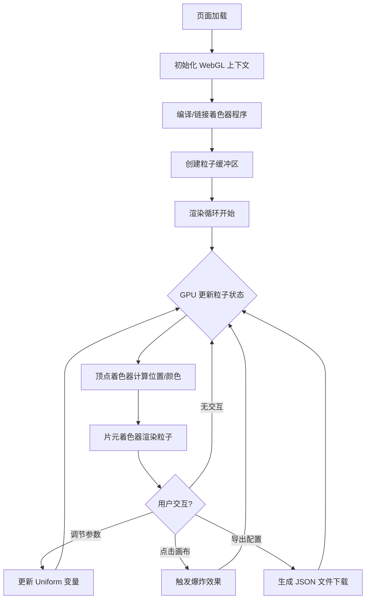

## 1. 产品概述

WebGL 粒子系统是一个浏览器端的实时 GPU 粒子渲染引擎，利用 WebGL 着色器实现数万粒子的高性能并行计算与渲染。用户可通过参数面板实时调控粒子行为，点击画布产生爆炸效果，并可将满意的效果导出为 JSON 配置文件供复用。

- 目标用户：视觉艺术家、游戏开发者、前端工程师、交互设计师
- 核心价值：零依赖轻量级粒子引擎，GPU 驱动的高性能渲染，所见即所得的参数调节体验

## 2. 核心功能

### 2.1 功能模块

1. **粒子画布页面**：WebGL 渲染画布、鼠标交互、爆炸效果
2. **参数控制面板**：实时参数调节、预设切换、配置导入/导出

### 2.2 页面详情

| 页面名称 | 模块名称 | 功能描述 |
|---------|---------|---------|
| 粒子画布页面 | WebGL 画布 | 渲染数万粒子，支持鼠标点击爆炸喷发 |
| 粒子画布页面 | 持续粒子发射 | 从画布中心/指定区域持续发射粒子，粒子具有生命周期 |
| 参数控制面板 | 发射速率控制 | 调节每帧发射粒子数量 |
| 参数控制面板 | 颜色渐变区间 | 设置粒子生命周期的起始色与终止色 |
| 参数控制面板 | 重力加速度 | 调节全局重力方向与强度 |
| 参数控制面板 | 风场方向 | 设置风向与风力大小 |
| 参数控制面板 | 湍流强度 | 控制粒子运动的随机扰动程度 |
| 参数控制面板 | 配置导出 | 将当前参数导出为 JSON 文件 |
| 参数控制面板 | 配置导入 | 从 JSON 文件加载参数配置 |

## 3. 核心流程

用户打开页面后，画布自动渲染粒子效果。用户通过侧边参数面板实时调节各项参数，画布立即响应变化。用户点击画布任意位置，触发爆炸式粒子喷发。调节满意后，点击导出按钮保存 JSON 配置。

## 4. 用户界面设计

### 4.1 设计风格

- **主色调**：深邃暗色背景（#0a0a0f），搭配青色/琥珀色高亮粒子效果
- **辅助色**：面板使用半透明毛玻璃效果，边框用微弱的青色光晕
- **按钮风格**：圆角胶囊按钮，悬停时发光效果
- **字体**：显示字体使用 Orbitron（科技感），UI 字体使用 DM Sans
- **布局风格**：全屏画布 + 左侧浮动可折叠控制面板
- **图标风格**：Lucide 线性图标，2px 描边

### 4.2 页面设计概览

| 页面名称 | 模块名称 | UI 元素 |
|---------|---------|---------|
| 粒子画布页面 | WebGL 画布 | 全屏黑色背景，粒子发光渲染，径向模糊后处理效果 |
| 粒子画布页面 | 控制面板 | 左侧浮动毛玻璃面板，分组滑块控件，数值实时显示 |
| 粒子画布页面 | 导出按钮 | 面板底部胶囊按钮，悬停发光，点击下载 JSON |
| 粒子画布页面 | 状态指示 | 右上角 FPS 计数器 + 粒子总数显示 |

### 4.3 响应式设计

- 桌面优先设计，画布始终全屏
- 控制面板在窄屏下可收起为图标触发
- 滑块控件支持鼠标拖拽与触摸滑动

### 4.4 3D/粒子场景指引

- **环境氛围**：深空背景，微弱星尘纹理
- **粒子表现**：发光圆形粒子，大小随生命周期衰减，颜色随生命周期渐变
- **爆炸效果**：从点击位置径向喷射，速度衰减，颜色从白热到冷色
- **后处理**：叠加混合模式实现粒子发光叠加效果
