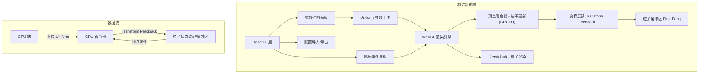

## 1. 架构设计



## 2. 技术说明

- **前端框架**：React 18 + TypeScript + Vite
- **样式方案**：Tailwind CSS 3
- **状态管理**：Zustand
- **渲染引擎**：原生 WebGL 2（不依赖 Three.js，以获得更精细的 GPU 控制和更高性能）
- **粒子计算**：GLSL 着色器 + Transform Feedback 实现 GPGPU 粒子更新
- **初始化工具**：vite-init
- **后端**：无（纯前端应用）
- **数据库**：无

### 核心技术决策

1. **使用 Transform Feedback 而非纹理回读**：WebGL 2 的 Transform Feedback 允许着色器输出直接写入缓冲区，避免 GPU→CPU→GPU 数据往返，实现真正的全 GPU 并行粒子更新。
2. **Ping-Pong 缓冲区策略**：双缓冲区交替读写，避免读写冲突。
3. **原生 WebGL 2**：相比 Three.js 抽象层，直接操作 WebGL API 可更精确控制 Draw Call 和内存布局，对数万粒子场景性能更优。
4. **叠加混合模式**：使用 `gl.blendFunc(gl.SRC_ALPHA, gl.ONE)` 实现粒子发光叠加效果。

## 3. 路由定义

| 路由 | 用途 |
|-----|------|
| `/` | 粒子画布主页面，包含 WebGL 渲染区与控制面板 |

## 4. 数据模型

### 4.1 粒子数据结构

每个粒子在 GPU 缓冲区中的数据布局：

| 属性 | 类型 | 偏移量 | 描述 |
|-----|------|--------|------|
| position | vec2 | 0 | 粒子位置 (x, y) |
| velocity | vec2 | 8 | 粒子速度 (vx, vy) |
| color | vec4 | 16 | 粒子颜色 RGBA |
| life | float | 32 | 当前生命值 (0.0~1.0) |
| maxLife | float | 36 | 最大生命值 |
| size | float | 40 | 粒子大小 |

每个粒子占 44 字节，50000 粒子 ≈ 2.1MB GPU 显存。

### 4.2 Uniform 参数定义

```glsl
uniform float uEmissionRate;    // 发射速率 0.0~1.0
uniform vec2 uGravity;          // 重力加速度 (gx, gy)
uniform vec2 uWind;             // 风场方向与强度 (wx, wy)
uniform float uTurbulence;      // 湍流强度 0.0~2.0
uniform vec4 uColorStart;       // 起始颜色 RGBA
uniform vec4 uColorEnd;         // 终止颜色 RGBA
uniform float uTime;            // 全局时间
uniform vec2 uExplosionPos;     // 爆炸位置
uniform float uExplosionTime;   // 爆炸触发时间
uniform float uExplosionStrength; // 爆炸强度
```

### 4.3 JSON 配置文件格式

```json
{
  "emissionRate": 0.5,
  "gravity": { "x": 0.0, "y": -9.8 },
  "wind": { "x": 1.0, "y": 0.0 },
  "turbulence": 0.3,
  "colorStart": { "r": 1.0, "g": 0.6, "b": 0.2, "a": 1.0 },
  "colorEnd": { "r": 0.2, "g": 0.4, "b": 1.0, "a": 0.0 },
  "particleSize": 3.0,
  "maxParticles": 50000
}
```

## 5. 着色器架构

### 5.1 更新着色器（顶点着色器 + Transform Feedback）

- 读取当前帧粒子状态（位置、速度、生命值）
- 应用物理计算：重力 + 风场 + 湍流（基于噪声函数）
- 更新生命值，生命值归零的粒子重置为新生粒子
- 输出下一帧粒子状态到 Transform Feedback 缓冲区

### 5.2 渲染着色器

- 顶点着色器：根据粒子位置和大小计算 gl_Position 与 gl_PointSize
- 片元着色器：绘制发光圆形粒子，颜色根据生命值在起始色与终止色间插值，alpha 随生命值衰减

## 6. 项目文件结构

```
src/
├── components/
│   ├── ParticleCanvas.tsx      # WebGL 画布组件
│   ├── ControlPanel.tsx        # 参数控制面板
│   ├── ParameterSlider.tsx     # 通用滑块控件
│   ├── ColorPicker.tsx         # 颜色选择器
│   ├── ExportButton.tsx        # 导出按钮
│   └── StatsOverlay.tsx        # FPS/粒子数统计
├── hooks/
│   └── useParticleEngine.ts   # WebGL 引擎 Hook
├── store/
│   └── particleStore.ts       # Zustand 状态管理
├── shaders/
│   ├── update.vert            # 粒子更新顶点着色器
│   └── render.vert            # 粒子渲染顶点着色器
│   └── render.frag            # 粒子渲染片元着色器
├── utils/
│   └── glUtils.ts             # WebGL 辅助工具函数
├── App.tsx
└── main.tsx
```
